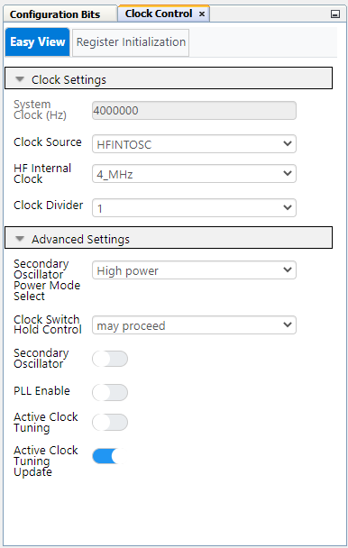

<!-- Please do not change this html logo with link -->

<a href="https://www.microchip.com" rel="nofollow"></a>

# Multi-Voltage I/O (MVIO) in Three Different Examples Using PIC18F56Q24 Microcontroller Generated with MCC Melody

<br>The repository contains three MPLAB® X projects:

[1. MVIO Logic](#1-mvio-1-logic) This use case shows how to configure two output pins that provide different output voltage levels: 3.3V for a non-MVIO pin and 5V for an MVIO pin.

[2. MVIO Interrupt](#2-mvio-interrupt) This use case shows how to configure the MVIO interrupt and turn on the on-board LED when the voltage drops below the acceptable threshold.

[3. MVIO Read Voltage](#3-mvio-read-voltage) This use case shows how to read the voltage on V<sub>DDIO2</sub> with the Analog-to-Digital Converter (ADC), and then send it through the Universal Asynchronous Receiver Transceiver (USART).

## Related Documentation

More details and code examples on the PIC18F56Q24 can be found at the following links:

- [PIC18F56Q24 Product Page](https://www.microchip.com/wwwproducts/en/PIC18F56Q24)
- [PIC18F56Q24 Code Examples on GitHub](https://github.com/microchip-pic-PIC-examples?q=PIC18F56Q24)


## Software Used

- [MPLAB® X IDE](http://www.microchip.com/mplab/mplab-x-ide) v6.15 or newer
- [MPLAB® XC8](http://www.microchip.com/mplab/compilers) v2.45 or newer
- [PIC18F-Q_DFP Series Device Pack](https://packs.download.microchip.com) v1.23.425 or newer
- [MPLAB® Code Configurator](https://www.microchip.com/en-us/tools-resources/configure/mplab-code-configurator) 5.3.7 or newer
- [MPLAB® Code Configurator Melody](https://www.microchip.com/en-us/tools-resources/configure/mplab-code-configurator/melody) core 2.6.2 or newer


## Hardware Used

- The PIC18F56Q24 Curiosity Nano Development Board is used as a test platform.

<br>

## Prerequisites

For MVIO to work together with the Curiosity Nano board, disconnect the R201 resistor connecting V<sub>DDIO2</sub> to VCC_TARGET.

<br>

A power supply must be connected to the V<sub>DDIO2</sub> pin. There are two possible use cases:
<br />
**a.** Connecting an external DC power supply to the V<sub>DDIO2</sub> pin and GND.
<br />
**b.** Using Curiosity Nano, use V<sub>BUS</sub> as power supply, simply by connecting a wire between V<sub>BUS</sub> and V<sub>DDIO2</sub>.

## Initial Setup

These following configurations are set for each lab.

<br>

  - Clock Source: HFINTOSC
  - Internal Clock: 4 MHz
  - Clock Divider: 1

<br>

  - External Oscillator: Disabled
  - Reset Oscillator: 4 MHz

## Operation

To program the Curiosity Nano board with this MPLAB X project, follow the steps provided in the [How to Program the Curiosity Nano board](#how-to-program-the-curiosity-nano-board) chapter.<br><br>

## 1. MVIO Logic Level Demonstration

This program demonstrates the functionality of the MVIO pins of the PIC®  microcontrollers (MCUs). It configures two output high (logic `1`) pins; one is an MVIO pin, and the other one is non-MVIO.

**Note**: V<sub>DDIO2</sub> is connected to V<sub>BUS</sub> on the PIC Curiosity Nano board.

When using a voltmeter, it can be observed that the microcontroller is generating 3.3V on the non-MVIO pin and 5V on the MVIO pin. This example uses GPIO pins with different peripherals, such as, I<sup>2</sup>C, SPI, USART, Timers. Therefore, the voltage values for logic `1`, on MVIO and non-MVIO pins, differ. The MVIO module offers increased flexibility to the PIC18-Q24 Device family, allowing for communication with sensors/MPUs/SoCs at different operating levels, without needing external components such as level shifters.

### 1.1 Setup

|Pin                       | Configuration      |
|   ---------------------  |   ---------------- |
| RB4 - non-MVIO           | Digital Output     |
| RC4 - MVIO               | Digital Output     |

### 1.2 Demo

<br>

This gif shows the output voltage levels on the non-MVIO pin, 3.3V, and on the MVIO pin, 5V.
For this demonstration to work properly the User must **A.** Have a voltage source plugged into V<sub>DDIO2</sub>. **B.** Have outputs set, for a pin on V<sub>DD</sub>, and one on V<sub>DDIO2</sub>.


### 1.3 Summary

The first part of this program, demonstrates the differences and key new feature of the MVIO pins. By configuring two pins on different voltage domains, V<sub>DD</sub>, and V<sub>DDIO2</sub>, we are able to provide two different voltage supplies, on the same device. The VDD voltage supplied was 3.3V and the VDDIO2 voltage supplied in this example was 5.0V. Once these voltages were applied, the logic levels for each of the voltage domains correlated with the voltage supplied to each respective source. <br><br>

[Back to top](#multi-voltage-input--output-mvio-in-three-different-examples-using-PIC18F56Q24-microcontroller-generated-with-mcc-melody)<br>

## 2. MVIO Interrupt

This program demonstrates the functionality of the MVIO `VDDIO2nRDYIE` interrupt.

**Note**: V<sub>DDIO2</sub> is connected to an external and adjustable power supply.

When the V<sub>DDIO2</sub> voltage level falls out of the acceptable threshold, about 1.6V-5.5V, the RDY bit changes and an interrupt is issued. When the V<sub>DDIO2</sub> voltage goes back to the threshold, the RDY bit will change again, signaling the interrupt event is over. This is a level triggered interrupt, meaning it doesn't measure on the rising or falling edge, rather it is measured by the amplitude or level.

For this example, the on-board LED is turned on as long as the voltage is outside the threshold, and turned off when the V<sub>DDIO2</sub> is inside the threshold.

### 2.1 Setup

|Pin                       | Configuration      |
| :---------------------:  | :----------------: |
| RF2 (LED pin)            | Digital output     |


This example requires the RDY interrupt to be enabled, which can be done in the interrupt tab in MCC, or enabled by code.

### MCC

<br>

the figure above provides a screenshot illustrating what it should look like when the VDDIO2RDYIF is enabled in MCC

### Code
To implement using code, an Interrupt Service Routine (ISR) and Interrupt manager were added.

```
static void MVIO_ISR(void)
{                  
    LATFbits.LATF2 = 0;   
}
```

```
  void __interrupt() INTERRUPT_InterruptManager (void)
  {
    /* Check if MVIO_RDY interrupt is enabled and if the interrupt flag is set */
    if(PIE11bits.VDDIO2nRDYIE == 1 && PIR11bits.VDDIO2nRDYIF == 1)

    {
        PIR11bits.VDDIO2nRDYIF = 0;
        MVIO_ISR();
       __delay_ms(50);

    }
  }
```


### 2.2 Demo

<br>

<br> This gif shows what happens when the V<sub>DDIO2</sub> voltage drops below the MVIO threshold. In this example, a wire is placed between the V<sub>DDIO2</sub> and the V<sub>BUS</sub>, that is used as a power supply (5V) - the LED is turned off. The wire is then unplugged (0V) - the LED is turned on.

### 2.3 Summary

This program demonstrates the use of the MVIO interrupt to turn on an LED when the voltage applied to MVIO is too low. <br><br>
[Back to top](#multi-voltage-input--output-mvio-in-three-different-examples-using-PIC18F56Q24-microcontroller-generated-with-mcc-melody)<br>

## 3. MVIO Read Voltage

This program reads the voltage on V<sub>DDIO2</sub> using an internal ADC channel connected to it.

It is possible that the ADC operates at a voltage lower than the MVIO. To be able to handle such cases, the ADC channel connected to MVIO provides the V<sub>DDIO2</sub> voltage divided by 10. This means that the ADC measures a voltage ten times smaller than the actual voltage, this way it can safely handle the case when V<sub>DDIO2</sub> is greater than V<sub>DD</sub>.

**Note**: A power supply must be connected to the V<sub>DDIO2</sub> pin. There are two possible use cases:
<br />
**a.** Connecting an external DC power supply to the V<sub>DDIO2</sub> pin and GND.
<br />
**b.** Using Curiosity Nano, use V<sub>BUS</sub> as power supply, simply by connecting a wire between V<sub>BUS</sub> and V<sub>DDIO2</sub>.

The program converts the reading into voltage, and sends it to USART every 500 ms.

## 3.1 Setup

<br>

  - Basic Mode
  - Right Alignment
  - Positive Input Channel: VDDIO2_by_10
  - Clock Source: ADCRC


<br>

 - UART dependency: UART 2

<br>

  - Enable Redirect to Printf is enabled for only one UART driver.


|Pin                       | Configuration      |
| :---------------------:  | :----------------: |
| RB5 (USART2 TX)          | Digital Output     |


### 3.2 Demo

<br>

The figure above shows the messages received from the board during normal operation.

### 3.3 Summary

This program shows how to read the value of the voltage on V<sub>DDIO2</sub> and send the information through USART. <br><br>
[Back to top](#multi-voltage-input--output-mvio-in-three-different-examples-using-PIC18F56Q24-microcontroller-generated-with-mcc-melody)<br>

## How to Program the Curiosity Nano board

This chapter shows how to use the MPLAB® X IDE to program an PIC® device with an Example_Project.X. This can be applied for any other projects.

- Connect the board to the PC.

- Open the Example_Project.X project in MPLAB X IDE.

- Set the Example_Project.X project as main project.

  - Right click on the project in the **Projects** tab and click **Set as Main Project**.
    <br>

- Clean and build the Example_Project.X project.

  - Right click on the **Example_Project.X** project and select **Clean and Build**.
    <br>

- Select the **PICxxxxx Curiosity Nano** in the Connected Hardware Tool section of the project settings:

  - Right click on the project and click **Properties**
  - Click on the arrow under the Connected Hardware Tool
  - Select the **PICxxxxx Curiosity Nano** (click on the **SN**), click **Apply** and then click **OK**:
    <br>

- Program the project to the board.
  - Right click on the project and click **Make and Program Device**.
    <br>

- - -

- [Back to 1. MVIO 1 Logic](#1-mvio-1-logic)
- [Back to 2. MVIO Interrupt](#2-mvio-interrupt)
- [Back to 3. MVIO Read Voltage](#3-mvio-read-voltage)
- [Back to top](#multi-voltage-input--output-mvio-in-three-different-examples-using-PIC18F56Q24-microcontroller-generated-with-mcc-melody)

- - -
